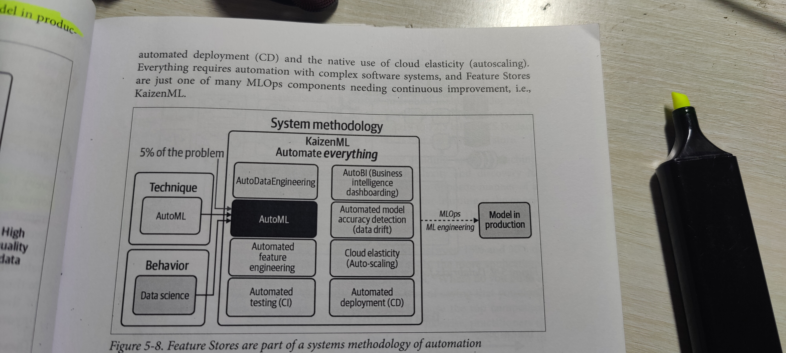

Summary:

- Packaging ML Model is all about getting a model into container to take advantage of contarized processed to help sharing, distributing and easy deployment

- The example in the reposhows using an ONNX model and package within a container that serves a Flask app that performs the prediction.

- GitHub actions shows an example of creating a container while the model is in Microsoft Azure Model Registry, image is created by retrieving the model from Azure Model Regstry and then finally creating an Docker image which is later pushed to GitHub Container Registry.*

Model Used:
    - RoBERTa Sequence Classification 
    - place the model (.onnx) file inside /webapp directory
    - URL: https://github.com/onnx/models/blob/main/text/machine_comprehension/roberta/model/roberta-sequence-classification-9.onnx

# test local
- cd webapp
- python app.py
- curl -X POST "Content-Type: application/JSON" --data '["Containers are more or less interesting"]' http://0.0.0.0:5000/predict
- curl -X POST "Content-Type: application/JSON" --data '["MLOps is critical for robustness"]' http://0.0.0.0:5000/predict

# docker test
- docker build -t paritoshgupta/roberta .
- docker run -it -p 5000:5000 --rm paritoshgupta/roberta
- curl -X POST "Content-Type: application/JSON" --data '["Espresso is too strong"]' http://0.0.0.0:5000/predict

- **Secrets required for Microsoft Azure and GitHub Container Registry.**

# General Notes

- CI/CD platforms are the foundation of automation and reliable results.
- Build, Test, Release, Deploy and Validate.
- SageMaker is a specialized ML platform that goes beyond offering steps in a pipeline to accomplish a goal like publishing a model.
- AutoML is the automation of the tasks related to training a model on clean data.
- A pipeline is nothing but a set of steps to perform specific objective like Publishing model into production environment when run.
- Flake8  for Python for linting
- What may happen in ML and AI is that the technique is essentially commotized. Instead, the automation itself and the ability to execute the automation is the key. 
- Even with extensive automation in machine learning, humans must make executive decisions about the bigger picture. 
- Automation through continuous improvement allows data scientists, ml engineers and entire org to focus on what matters i.e. execution.
- All complex software require automation and simplification of critical components.
- KaizenML - Automated Process Improvement;  AutoML - Automated Model Creation
- KaizenML involved building Features Stores i.e. a registry of high-quality ML inputs and the ability to monitor data for drift and register and serve out ML models.
- Continuously improve ML is the concept of a Feature Store.
- Feature Store solves:
    - Allows users to add features they built into a shared Feature Store
    - Once the features are in the Feature store, they are easy to use in Training and Prediction.
- Data Science is a behavior, AutoML is a technique. AutoML could only 5% of the entire problem. 
    - The data itself needs automation through ETL job management
    - The Fature store needs automation to improve the quality of ML inputs
    - The deployment required automation through automated deployment (CD) and the native use of Cloud elasticity (Auto-scaling)
    - Everything requires automation through complex software systems, and Features Stores are just one of many MLOps components needing continuous improvement i.e. KaizenML.

    

