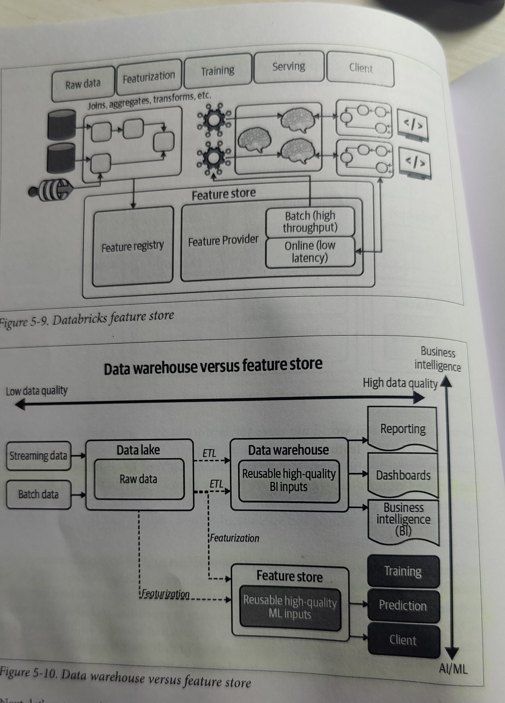

Summary:

- Packaging ML Model is all about getting a model into container to take advantage of contarized processed to help sharing, distributing and easy deployment

- The example in the reposhows using an ONNX model and package within a container that serves a Flask app that performs the prediction.

- GitHub actions shows an example of creating a container while the model is in Microsoft Azure Model Registry, image is created by retrieving the model from Azure Model Regstry and then finally creating an Docker image which is later pushed to GitHub Container Registry.*

Model Used:
    - RoBERTa Sequence Classification 
    - place the model (.onnx) file inside /webapp directory
    - URL: https://github.com/onnx/models/blob/main/text/machine_comprehension/roberta/model/roberta-sequence-classification-9.onnx

# test local
- cd webapp
- python app.py
- curl -X POST "Content-Type: application/JSON" --data '["Containers are more or less interesting"]' http://0.0.0.0:5000/predict
- curl -X POST "Content-Type: application/JSON" --data '["MLOps is critical for robustness"]' http://0.0.0.0:5000/predict

# docker test
- docker build -t paritoshgupta/roberta .
- docker run -it -p 5000:5000 --rm paritoshgupta/roberta
- curl -X POST "Content-Type: application/JSON" --data '["Espresso is too strong"]' http://0.0.0.0:5000/predict

- **Secrets required for Microsoft Azure and GitHub Container Registry.**

# General Notes on KaizenML 

- Practitioners of ML can piggyback on the research FAANG have done. They all see a future in high-level automated ML running on specialized hardware.
- KaizenML - Automated Process Improvement;  AutoML - Automated Model Creation
- KaizenML involved building Features Stores i.e. a registry of high-quality ML inputs and the ability to monitor data for drift and register and serve out ML models.
- Continuously improve ML is the concept of a Feature Store.
- Feature Store solves:
    - Allows users to add features they built into a shared Feature Store
    - Once the features are in the Feature store, they are easy to use in Training and Prediction.
- Data Science is a behavior, AutoML is a technique. AutoML could only 5% of the entire problem. 
    - The data itself needs automation through ETL job management
    - The Fature store needs automation to improve the quality of ML inputs
    - The deployment required automation through automated deployment (CD) and the native use of Cloud elasticity (Auto-scaling)
    - Everything requires automation through complex software systems, and Features Stores are just one of many MLOps components needing continuous improvement i.e. KaizenML.
- AutoML Platforms:
    - Apple's CreateML; models can be converted into ONNX and can be used anywhere. 
    - Apple's Core ML
- Computer Vision on the GCP platform. These options appear in order of difficulty:
    - write ML code that trains a model 
    - use Google AutoMl Vision
    - Download a pretrained model from Tensorflow Hub
    - use the Vision AI API
    - Google's managed ML platform - Vertex AI
- Modeling is a trivial amount of the work in a real-world ML system. Likewise, it should be no surprise that AutoML, i.e. the automation of modeling is a small part of what needs to be automated
- Everything from DATA AUTOMATION TO FEATURE STORAGE TO MODELING TO DEPLOYMENT TO AN EVAULATION OF MODEL IN PRODUCTION is a canditate for full automation.
- KaizenML means you are constantly improving every single part of the machine learning system.
- Just as Automated transmission and cruise-control systems assist an expet driver, automation of the subcomponent of a production machine learning system makes the human in charge of the ML decisions better.

